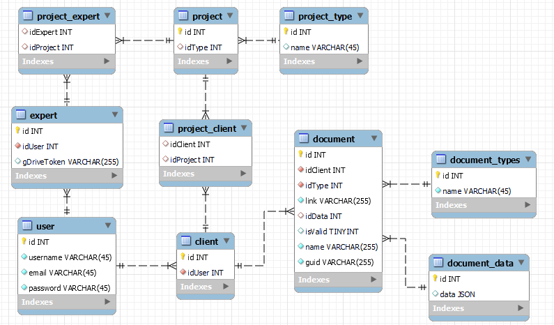
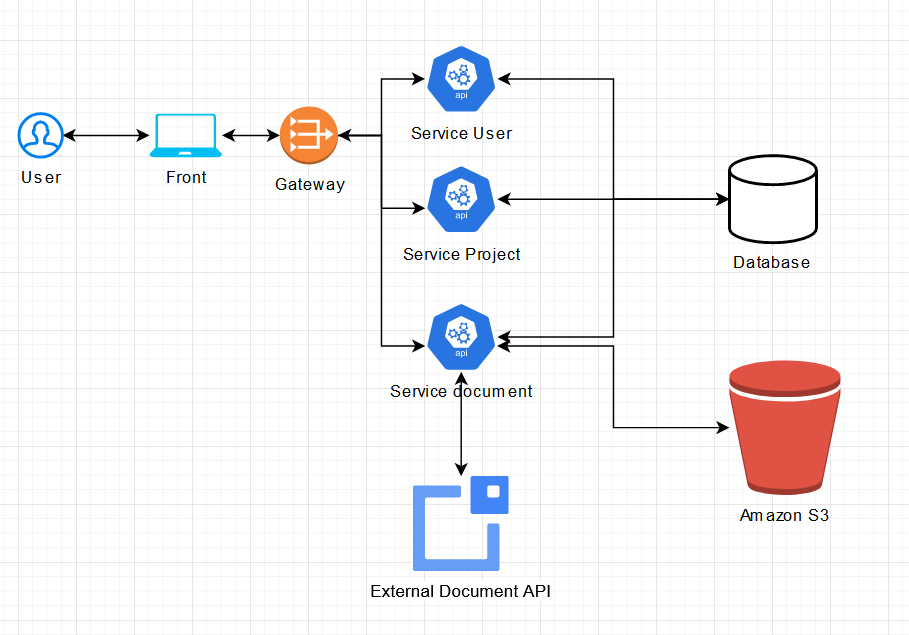

# Pretto test technique

## Schéma de base de données



Dans chacune des tables, il y aura également les champs :

- `date_created` (TIMESTAMP) automatiquement mis à jour à la création de la donnée
- `date_update` (TIMESTAMP) automatiquement mis à jour à chaque update de la table

## Architecture de l'application



Voici les différentes routes du service Documents. Les autres services sont constitués d'un simple CRUD

| Verbe  | Route                                         | Action                                            |
| :----: | --------------------------------------------- | ------------------------------------------------- |
| POST   | `/project/:id_project/document`               | Crée un nouveau document dans le projet spécifié  |
| PUT    | `/project/:id_project/document/:id_document`  | Met à jour le document spécifié                   |
| GET    | `/project/:id_project/document/:id_document`  | Récupère le détail d'un document                  |
| DELETE | `/project/:id_project/document/:id_document`  | Supprime le document                              |
| GET    | `/project/:id_project/documents/`             | Récupère les header des documents du projet       |
| PUT    | `/document/:uuid`                             | Met à jour les datas du document                  |

Lors de l'upload d'un document, le document sera accompagné d'un corps avec les informations du document :

```json
{
  "name": "CNI_JohnDoe",
  "type": { "id": 1, "name": "CNI" },
  "client": { "id": 1, "username": "JohnDoe" }
}
```

### Création d'un document

Lors de la création d'un document :

1. Le fichier est stocké sur le bucket AWS
2. Le champ `link` est rempli avec l'id du document stocké
3. Le fichier est envoyé chez le back office externe

En attendant la validation du fichier, le status `isValid` reste à `NULL`

Une fois le fichier validé, le prestataire peut consommer l'API `PUT /document/:uuid` pour mettre à jour le fichier identifié grâce à un Global Unique Identifier.

Il pourra donc renseigner les données extraites et si le fichier est valide mettre à jour le fichier sur le bucket.

Une fois le document validé, l'expert pourra consommer la route `GET /project/:id_project/document/:id_document` afin d'avoir toutes les informations sur le document du client.

## Exemple

1. Dans son interface, Mr Durand clique sur le bouton d'upload du document demandé
2. Une fois ses fichiers choisis, l'envoi des documents est effectué, la gateway renvoie la requête vers le service document
3. Multer stocke les différents documents en les nommant grâce à un uuid
4. Les fichiers sont envoyés sur le bucket
5. Requête SQL d'insertion dans la table `document` avec les `link` du bucket
6. Pour chaque fichier inséré, requête envoyée vers le back office externe pour valider les différents documents
7. Une fois le fichier validé, la CNI est envoyée dans le Drive de l'expert qui y aura toutes les informations

## Ajout de préstataire

Dans le cas où un nouveau prestataire viendrait s'ajouter pour d'autres vérifications de documents, il suffirait d'envoyer le document sur son API pour le type de document reçu et le reste du service fonctionnerait de la même manière.

## Remarques

En fonction du format nécéssaire pour l'expert, certains champs doivent être ajouter pour hierarchiser ses dossier dans son drive comme par exemple le nom du project et des clients plutôt que d'avoir des id pour son architecture :

- `/:project_name/:client_1/:type_file/`
- `/achat_mr_durand/jean_durand/cni/`
- `/achat_mr_durand/marie_durand/cni/`
